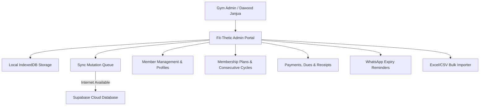

# Fit-Thetic Fitness Club — System Capabilities & Architecture Manual

**Official Platform Documentation**  
*Gym Name*: **Fit-Thetic Fitness Club**  
*Location*: **Royal Avenue, Meherban Colony, Chak Shahzad, Islamabad**  
*Owner & Head Trainer*: **Dawood Janjua** (`03216422429`)  

---

## 1. Executive Summary & Purpose

The **Fit-Thetic Fitness Club Gym Management System** is a high-performance, **Admin-Only**, **Offline-First** desktop and web platform engineered specifically for gym owners and desk managers. 

Gym customers never log into this portal. Instead, it equips the gym owner with a centralized, automated control center to solve all manual management headaches:
- Member onboarding and record keeping
- Consecutive membership cycle tracking
- Real-time unpaid dues and fee collection
- Automated WhatsApp expiry reminders
- Instant 80mm thermal and A4 official receipt generation
- Frictionless offline operation with zero data loss



---

## 2. Comprehensive System Capabilities (What The App Can Do)

### 2.1. Member Directory & Profiles
- **Member Registration**: Instant registration capturing Member Name, Phone (`03XX-XXXXXXX`), Gender, Date of Birth, Emergency Contact, and Profile Notes.
- **Auto-Generated Gym Codes**: Auto-assigns consecutive IDs formatted as `FT-0001`, `FT-0002`...
- **Multi-Factor Search & Filtering**: Real-time search across Name, Member Code, and Phone number. Filter by status (*Active*, *Expiring Soon*, *Expired*, *Unpaid*), Plan, or sort by registration date, dues, and urgent expiry.
- **Comprehensive Member 360° Profile**:
  - Full membership timeline and consecutive cycle history.
  - Complete payment ledger showing all past transactions, methods, and receipts.
  - 1-click quick actions (*Record Payment*, *Extend Plan*, *Renew Expired*, *Send WhatsApp Reminder*).

---

### 2.2. Membership Plans & Strict Consecutive Cycle Engine
- **Flexible Plans**: Pre-configured and customizable membership tiers (e.g. *Monthly Standard*, *Student Special*, *Quarterly 3-Month*, *Annual VIP*).
- **Strict Consecutive Renewal Date Engine**:
  - If a member's previous cycle expired on `Aug 17` and they pay on `Aug 22`, the system starts their consecutive renewal from the day after previous expiry (`Aug 18` to `Sept 17`).
  - No unpaid gap days are lost, protecting gym revenue.
- **Cycle Status Auto-Classification**:
  - 🟢 **Active**: Valid membership with >7 days remaining.
  - 🟡 **Expiring Soon**: Valid membership with ≤7 days remaining.
  - 🔴 **Expired**: Membership period has ended. Automatically dynamically marked as unpaid for the next cycle.

---

### 2.3. Payments & Real-Time Dues Tracking
- **Multi-Method Fee Recording**: Accepts **Cash**, **Easypaisa**, **JazzCash**, **Bank Transfer**, and custom methods with optional transaction reference numbers.
- **Dynamic Arrears & Unpaid Tracker**:
  - Identifies active members with unpaid partial balances.
  - Dynamically flags expired members with balance due equal to their renewal plan fee.
- **1-Click "Extend Plan" Action**:
  - If an active member pays on day 29 before their plan expires, admin can click **"Extend Plan"** to record fee and automatically increase their membership period for the next consecutive cycle.
- **Membership Plan Selection on Every Payment**:
  - Admins can change or upgrade a member's plan directly from the payment popup, automatically recalculating dues and dates in real time.

---

### 2.4. Digital & Printable Receipts (Thermal POS & A4)
- **Automatic Receipt Generation**: Every payment creates a permanent, immutable digital receipt with sequential numbering (`REC-2026-0001`).
- **Dual Printable Formats**:
  1. **80mm POS Thermal Slip**: Compact, high-density format designed for standard POS thermal receipt printers. Includes gym logo, member code, plan validity, total paid, and **Dawood Janjua's authorized signature**.
  2. **A4 Official Invoice Sheet**: Full-size invoice sheet suitable for formal gym memberships, corporate clients, or PDF downloads.
- **Receipts Archive**: Historical ledger with date filtering, member search, and 1-click re-print / view.

---

### 2.5. Automated WhatsApp Expiry Reminders
- **Smart Expiry Queuing**:
  - Automatically identifies members expiring in 7 days, 3 days, 1 day, and on the day of expiry.
- **1-Click Direct WhatsApp Delivery**:
  - Uses direct `https://wa.me/{phone}?text={message}` integration without requiring expensive third-party SMS gateways.
  - Opens WhatsApp Web or WhatsApp Mobile instantly with a personalized message:
    > *"Hi {name}, your membership at Fit-Thetic Fitness Club expires on {expiry_date}. Renew today to keep your training streak! - Dawood Janjua"*
- **Reminder Dispatch History**: Records dispatch timestamps to avoid sending duplicate reminders on the same day.

---

### 2.6. Excel & CSV Bulk Member Importer
- **Migration Engine**: Seamlessly import existing gym members from Excel or CSV spreadsheets.
- **Column Mapping**: Automatically detects Name, Phone, Plan, Start Date, End Date, and Fee Paid.
- **Integrity Validation**: Sanitizes phone numbers, handles missing dates, and auto-assigns sequential gym codes during batch import.

---

### 2.7. Offline-First Architecture & Cloud Sync
- **100% Offline Capable**: All operations (*Member creation, renewals, payments, receipts, search*) work completely without internet connection using browser **IndexedDB**.
- **Background Sync Mutation Queue**: Any changes made while offline are queued locally. As soon as internet connectivity returns, the sync engine automatically pushes updates to the cloud database (Supabase PostgreSQL).
- **Zero UI Freezing**: All calculations, filtering, and searches execute synchronously in-memory for instant 60 FPS performance.

---

### 2.8. Discord-Inspired Human UI Design
- **Theme**: Authentic Discord dark palette (`#1E1F22` background, `#2B2D31` sidebar, `#313338` cards).
- **Accents**: Discord Blurple (`#5865F2`) for primary CTAs, Green (`#23A55A`) for active/paid, Yellow (`#F0B232`) for expiring, Red (`#DA373C`) for unpaid/expired.
- **Centered Modal System**: All popups are anchored in the center of the viewport with fixed sticky action footers, ensuring buttons are never cut off.

---

## 3. Technical Architecture & How It Works Under The Hood

```
┌───────────────────────────────────────────────────────────────────────┐
│                        FIT-THETIC FRONTEND (Vite + React)              │
├───────────────────────────────────────────────────────────────────────┤
│  UI Components (Discord Theme)                                        │
│  ├── Dashboard, Members, Payments, Unpaid, Receipts, WhatsApp, Settings│
│  └── Centered Modals: RecordPaymentModal, AddMemberModal, etc.         │
├───────────────────────────────────────────────────────────────────────┤
│  State & Reactive Layer (GymContext.tsx + AuthContext.tsx)             │
│  ├── enrichedMembers (Reactive computation of timing status & dues)   │
│  ├── unpaidMembers & expiringMembers (Memoized instant filters)       │
│  └── WhatsApp URL Generator (Pure URL builder, 0 re-renders)          │
├───────────────────────────────────────────────────────────────────────┤
│  Storage Layer (db.ts)                                                │
│  └── IndexedDB Stores: members, plans, memberships, payments, receipts│
├───────────────────────────────────────────────────────────────────────┤
│  Sync Engine (syncEngine.ts)                                          │
│  ├── Offline Mutation Queue (FIFO IndexedDB store)                    │
│  └── Cloud Sync Handler (Idempotent upsert to Supabase PostgreSQL)     │
└───────────────────────────────────────────────────────────────────────┘
```

---

## 4. Key Business Logic Rules

| Requirement | Implementation Rule |
| :--- | :--- |
| **Late Renewal Start Date** | Strict consecutive: `addDays(previous_membership.end_date, 1)`. Prevents skipped days. |
| **Expired Member Status** | Expired members are automatically treated as unpaid with `balance_due = plan.price`. |
| **Early Cycle Extension** | Active members can pay early; new cycle starts consecutive to active end date. |
| **Receipt Integrity** | Receipts are immutable; deletion is prohibited to maintain audit trail. |
| **Offline Resilience** | Write to IndexedDB first -> Update React UI -> Enqueue sync item -> Push to cloud when online. |

---

## 5. Summary of Navigation & Quick Shortcuts

- **Dashboard (`/`)**: High-level KPI cards, revenue numbers, expiring soon list, and unpaid counter.
- **Members (`/members`)**: Full directory, search by name/phone/code, quick status filter pills, CSV import.
- **Payments (`/payments`)**: Historical ledger of every collected rupee with transaction reference numbers.
- **Unpaid Members (`/unpaid`)**: Dedicated arrears dashboard with instant 1-click **"Collect Due"** buttons.
- **WhatsApp Reminders (`/whatsapp`)**: Expiry queue with 1-click WhatsApp message triggers.
- **Receipts Archive (`/receipts`)**: Digital archive of all issued receipts with thermal slip & A4 printing.
- **Settings & Sync (`/settings`)**: Official gym profile, manual cloud sync trigger, and CSV data export.

---
*Manual compiled for **Fit-Thetic Fitness Club** by Antigravity IDE.*
